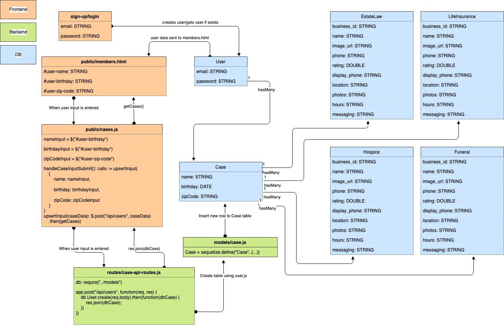
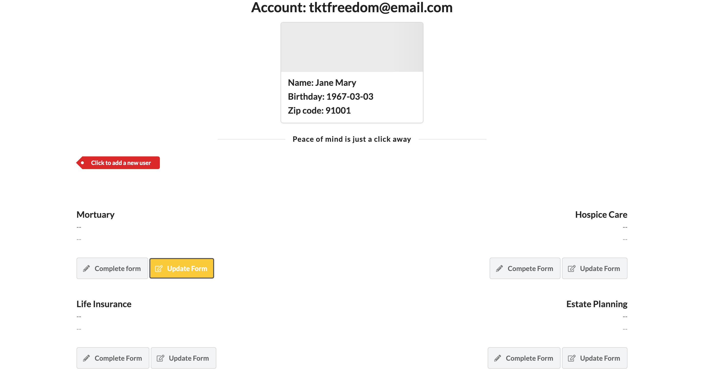
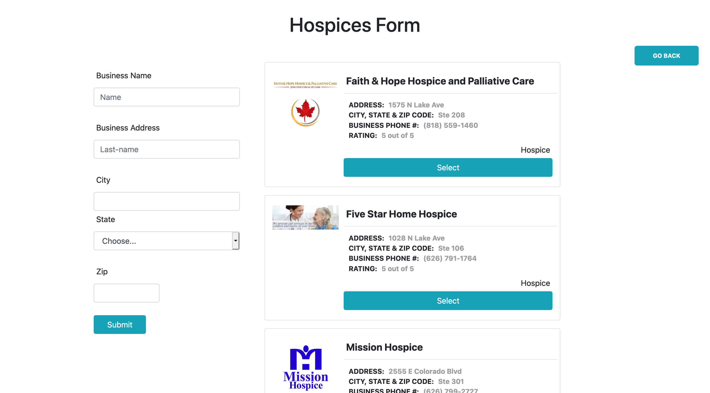
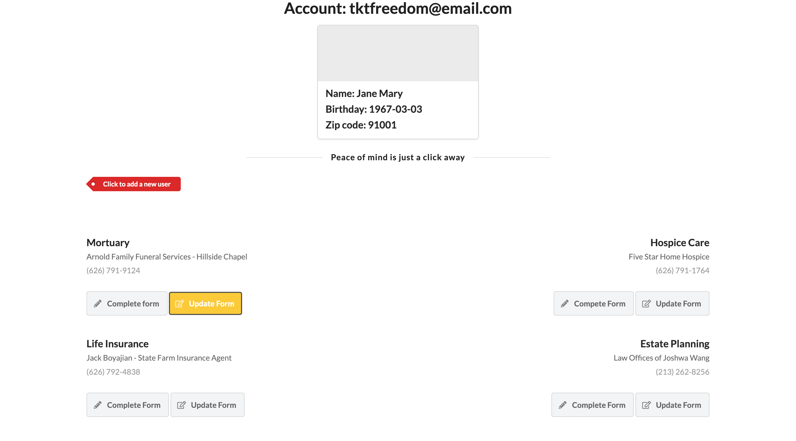
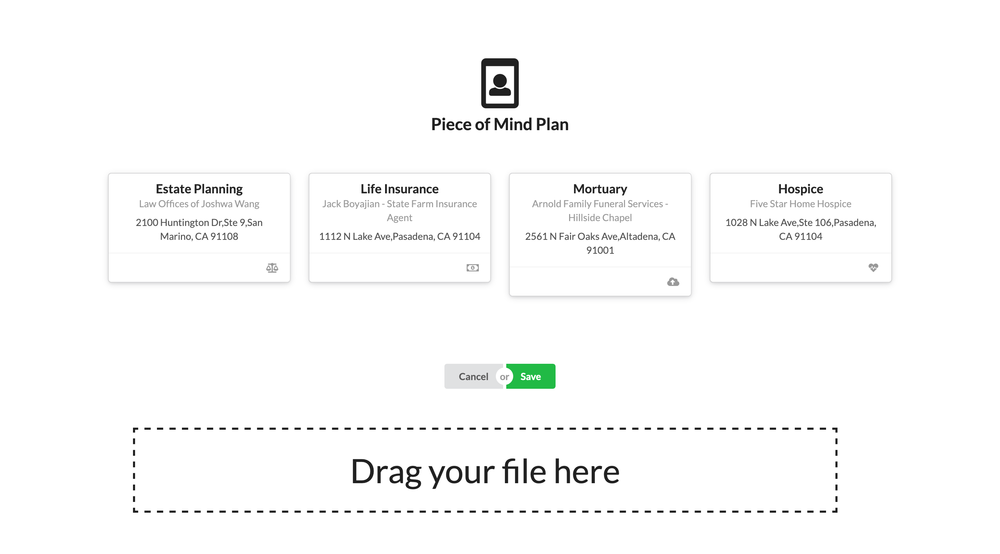

# Afterly
User-friendly marketplace for end of life services

## Authors
Edward Reyes, Jesus DeLintt, Will Flores, Sulada Sudjai

## Tables of Contents
* [Description](#description)

* [Technologies](#technologies)

* [Process](#process)

* [Challenges](#challenges)

* [Installation](#installation)

* [Deployment](#Deployment)

## Description
* Few people are truly prepared for the passing of friends or family.
* The current marketplace is confusing to navigate.
* Family members or friends already deal with emotional stress
* Afterly addresses these issues.
* Provides and easy-to-use web platform to organize the most important end of life services.

* Afterly allows users to save information for the following:
  * Hospice care
  * Lawyers
  * Life insurance
  * Funeral homes
  * Share your plans with close family and friends
  * Make a plan for relatives
  * Upload scanned pictures of a death certificate, important forms, etc
  * Create forms
  * Update forms

## Technologies

### Frontend:
HTML, CSS, BOOTSTRAP, SEMANTIC UI

### Backend:
JavaScript, MySQL, Sequelize, jQuery, Ajax, Express.js, yelp API, yelp-fusion.js, Passport.js, Bycrypt.js

This app uses yelp api to allow us to get all the businesses to display on our app.
We also used yelp-fusion to run the api through node and we created routes using
express to request data instead of requesting data directly from the client side. 


## Process

Backend Contributions:

Edward: 
* Configured the passport login to work with our app
* Set up the table templates
* Created User table, Case table, and EstateLaw table
* created yelp functions that incorporate yelp-fusion api calls
* Set up yelp-api-routes, html-routes, and api-table-routes
* Used ajax to make request to routes in order to get data, store data to tables
* Created the logic to send parameters to each page in order to save forms to the current case selected


## Installation

To install the necessary dependencies, run the following command:

```
npm i
```

## Challenges

* Passing in data to each html page since creating a form relies on having data of the current case. Each case has a zip code and id that is need to return businesses from the zip code and the id is used to create the foreign key for each business table. Our solution was passing in parameters when linking to another html page in order to have the search results reflect the user's zip code. 
* Managing tasks and working around git pull requests.


## Deployment
Heroku Deployment link: 
[Afterly](https://sheltered-escarpment-16015.herokuapp.com/)






